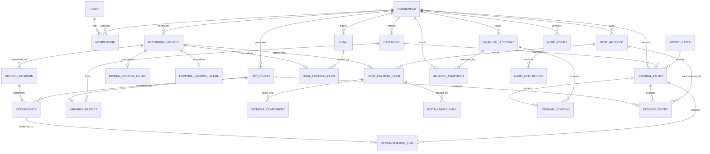

# Household Budget Application — Data Model

Status: Pre-build baseline
Last updated: 2026-08-21

This model separates four concerns that must not be conflated:

1. **Schedules** describe what is expected.
2. **Occurrences and budget periods** describe what is planned for one paycheck cycle.
3. **The ledger** records actual money movement without double-counting transfers.
4. **Allocation reserves** describe money intentionally held for later use; they are not bank accounts.

## 1. High-level entity relationships

## 2. Identity and household entities

### User

- UUID primary key
- Email/login identifier
- Display name
- Password-hash metadata
- MFA enrollment state
- Active/disabled timestamps
- Last authentication metadata

Authentication secrets, passkey credentials, TOTP enrollment, recovery-code hashes, and sessions live in dedicated framework/security tables rather than ordinary profile fields.

### Household

- UUID primary key
- Display name
- Currency code, initially USD
- IANA timezone, initially America/New_York
- Default theme and period preferences
- Created/updated timestamps

### Membership

- Household ID and User ID
- Role, initially equal `member` permissions for both users
- Invitation/enrollment state
- Joined/disabled timestamps

Unique constraint: one membership per user and household.

## 3. Scheduling and paycheck periods

### RecurringSource

Generic parent for scheduled income, fixed expense, debt payment, or goal contribution.

- UUID, household ID, source kind, display name
- Active/archived state
- Created-by and timestamps

### SourceRevision

An immutable, effective-dated version of a source schedule.

- Source ID
- Effective-from and optional effective-through dates
- Recurrence rule in validated structured fields
- Expected amount
- Weekend/holiday adjustment policy
- Source-specific configuration snapshot
- Revision number and created-by

Edits create a new revision; they do not mutate the revision that generated historical occurrences.

### Source specializations

- `IncomeSourceDetail`: expected/variable income, starts-period flag, budget-boundary day
- `ExpenseSourceDetail`: category, due-date policy, required/optional status
- `DebtPaymentPlan`: debt ID, monthly obligation, payment method, projection behavior
- `GoalFundingPlan`: goal ID, contribution amount and priority

Each specialization is one-to-one with a compatible RecurringSource kind.

### Occurrence

One generated instance of a source revision.

- Source and source-revision IDs
- Nominal date and adjusted expected date
- Assigned pay-period ID
- Planned and actual amounts
- Status
- Received/paid date
- Period override fields and reason
- Original period ID when moved
- Cancellation/archive metadata

An occurrence always retains provenance to the exact source revision that created it.

### PayPeriod

- Household ID
- Start date and exclusive next-start date
- Display end date
- Opening/closing state
- Anchor income occurrence references
- Projected, open, review, closed, or reopened status
- Closed timestamp and closing revision

Unique constraint: periods for one household may not overlap. Multiple anchor paychecks on the same date share one boundary.

### VariableBudget

- Pay-period ID and category ID
- Planned amount
- Optional notes or override provenance

Unique constraint: one budget per category per period.

## 4. Accounts and actual-money ledger

### FinancialAccount

- Household ID
- Name
- Type: Checking, Savings, Cash, Credit Card, or Other
- Asset/liability classification
- Optional last four digits
- Active/archived state

Full account, routing, and card numbers are not stored.

### JournalEntry

Header describing one actual financial event.

- Household ID and effective date/time
- Type: income, expense, expense refund, transfer, debt payment, goal contribution, interest/fee,
  or balance adjustment
- Description, category when applicable, and pay-period ID
- Manual/imported provenance
- One-to-one full-reversal relationship and many-to-one refund-adjustment relationship
- Created-by and timestamps

Committed entries are corrected through linked reversal/replacement entries rather than destructive editing of ledger postings.
An expense-refund entry credits the original expense category and debits the original financial
account. Multiple refunds may link to one purchase, but their cumulative amount cannot exceed the
original purchase.

### JournalPosting

- Journal-entry ID
- Financial-account or internal ledger-account ID
- Exact Decimal debit/credit amount
- Currency

Every committed JournalEntry must balance. UI transaction types generate the posting pairs so users do not need to understand double-entry accounting.

Examples:

- Checking purchase: debit expense category, credit Checking.
- Credit-card purchase: debit expense category, credit Card Liability.
- Card payment: debit Card Liability, credit Checking.
- Checking-to-Savings transfer: debit Savings, credit Checking.
- Paycheck: debit Checking, credit Income.

### OccurrenceReconciliation

Many-to-many link between actual JournalEntries and planned Occurrences.

- Household, Occurrence, and JournalEntry IDs
- Amount applied
- Created-by and created timestamp

The initial workflow creates explicit manual links. The records are append-only and PostgreSQL
rejects runtime-role update, delete, and truncate attempts. This supports one payment satisfying
multiple installments or one scheduled obligation being paid in parts.

### BalanceSnapshot

- Financial-account ID
- Observed balance and timestamp
- Source: manual or future integration
- Optional note

Snapshots help reconciliation but do not replace ledger history or paycheck-period calculations.

## 5. Credit-card payment reserve

Credit cards act as liability accounts. Categorized purchases are expenses on the purchase date; later payments are liability settlements.

### ReserveEntry (Household Reserve)

- Household ID, source pay-period ID, and posting pay-period ID
- Exact positive or negative amount
- Reason and source closing revision
- Destination label for an explicit Household Reserve allocation
- Created-by and timestamps

### CardPaymentReserveEntry

- Household ID, pay-period ID, and credit-card FinancialAccount ID
- One-to-one source JournalEntry ID
- Type: purchase, purchase reversal, payment, or payment reversal
- Signed reserve change
- Gross purchase-refund amount, retained even when a prior payment means no reserve is released
- Payment total, reserved-purchase settlement, and current-income debt-payoff split
- Optional budget-neutral correction for reversal ordering after a settled purchase is refunded
- Reason, created-by, and timestamps

Rules:

- A categorized credit-card purchase increases the matching card-payment reserve.
- A card payment consumes that reserve first.
- Payment beyond available card reserve is current-income-funded debt payoff.
- A refund or reversed purchase reduces both categorized spending and the card reserve.
- Multiple partial refunds are allowed up to the original purchase amount. Each creates a linked
  expense-refund JournalEntry plus its own protected reserve correction.
- Reserve entries are append-only corrections; current balances are derived sums.
- A payment reversal restores only reserve still backed by active purchases; any refund-adjusted
  remainder stays budget-neutral rather than creating a phantom reserve or debt payoff.
- The application blocks direct create/update/delete operations, and PostgreSQL rejects update,
  delete, and truncate attempts by the runtime role.

## 6. Debts and split mortgage payments

### DebtAccount

- Household ID, name, and type
- Current principal or statement balance
- APR and compounding/day-count method
- Minimum/monthly obligation
- Due-date policy
- Active/paid-off state
- Projection assumptions and last reconciliation date

A credit card may reference the same liability represented by a FinancialAccount.

### DebtPaymentPlan

- Recurring-source ID and debt-account ID
- Full monthly obligation
- Required minimum
- Extra-principal policy
- Statement-cycle date

### PaymentComponent

Breakdown of the full obligation:

- Principal and interest amount or estimated allocation
- Escrow taxes/insurance
- PMI
- Fees
- Extra principal

Only principal and interest participate in loan amortization. Escrow, PMI, taxes, insurance, and fees remain cash-flow/expense components.

### InstallmentRule

- Debt-payment-plan ID
- Installment order
- Day-of-month or recurrence rule
- Planned amount or percentage of monthly obligation

For the household mortgage, two monthly installment rules must total the full monthly obligation. These are two payments per month, not an every-two-weeks schedule.

## 7. Goals

### Goal

- Household ID, name, and type
- Current amount and target amount
- Optional target date
- Priority, active/paused/completed state
- Automatic-excess-allocation setting

Goal contributions are actual JournalEntries and may also satisfy planned goal-contribution Occurrences.

## 8. CSV imports

### ImportBatch

- Household, user, target account, and uploaded timestamp
- Original filename metadata without server path
- File checksum, selected column mapping, date format, and expense-sign rule
- Staged, ready, duplicate, category-required, rejected, and committed counts
- Uploaded, previewed, committed, or abandoned status
- Idempotent submission/confirmation tokens and completion/raw-data-deletion timestamps

### ImportRow

- Batch and source row number
- Temporary bounded raw-cell mapping used only for preview
- Normalized date, description, positive expense amount, category, and duplicate fingerprint
- Staged, ready, duplicate, category-required, rejected, or committed status
- Optional resulting JournalEntry link after confirmation

Staged rows are not JournalEntries until confirmation. The uploaded file itself is never persisted.
Commit scrubs every staged raw-cell mapping while retaining normalized provenance and links to the
append-only JournalEntries.

## 9. Protected audit entities

### AuditEvent

- Monotonic sequence and immutable UUID
- Household, actor, request/correlation ID
- Entity type/ID and action
- Canonical before/after payload
- Previous hash and current hash
- Server timestamp

### AuditCheckpoint

- Household ID
- Last event sequence, event count, and chain-head hash
- Verification/signature metadata
- External-copy timestamp

Audit entities live in a separately owned schema and follow the controls in `PRODUCT_SPEC.md` and `SECURITY_PLAN.md`.

## 10. Database invariants

1. Monetary values use fixed-precision decimal columns and one household currency.
2. Journal postings for a committed entry balance exactly.
3. Pay periods for a household never overlap.
4. Source revisions for one source do not have overlapping effective ranges.
5. An occurrence references exactly one source revision and one assigned period.
6. An override never mutates its source revision.
7. Reserve balances derive from append-only ReserveEntries.
8. Two mortgage installments configured as a full-month plan total the monthly obligation.
9. Audit mutation permissions are unavailable to runtime credentials.
10. Every household-owned foreign-key traversal is validated against the same household.
