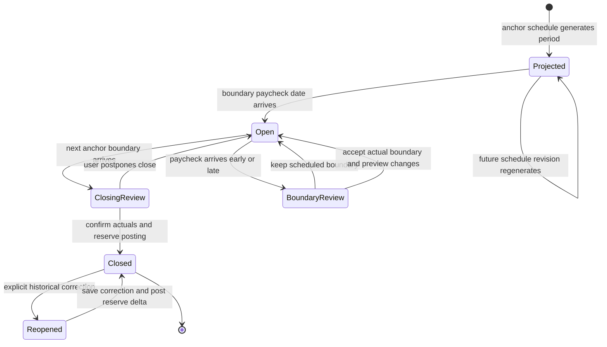
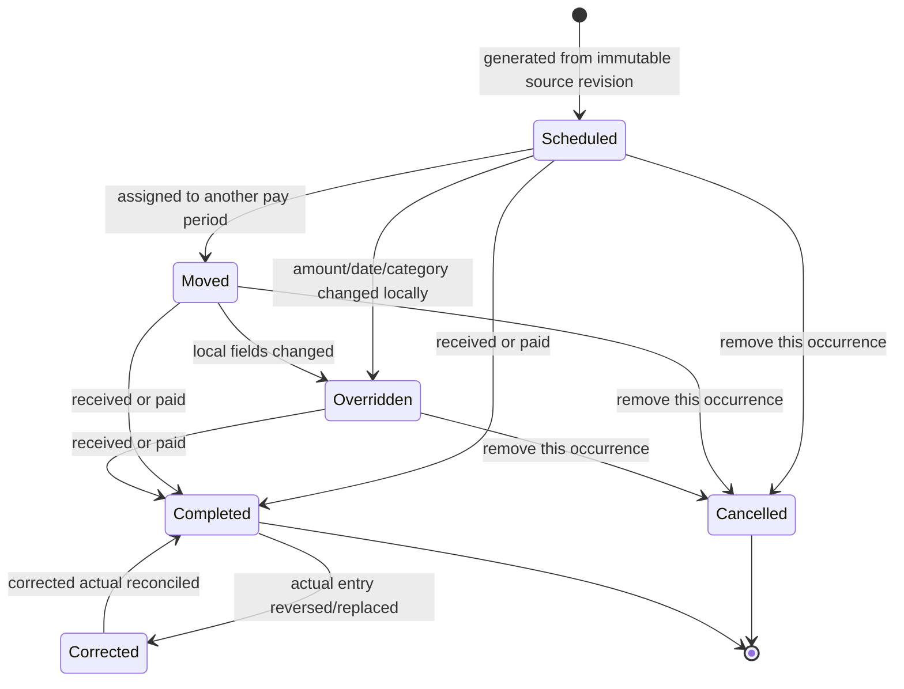
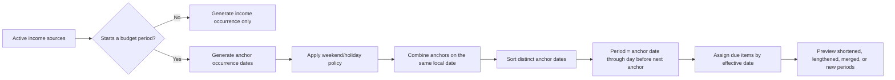
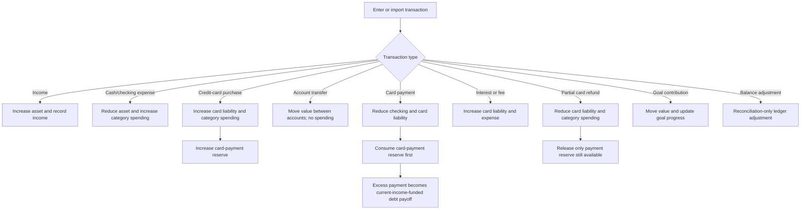
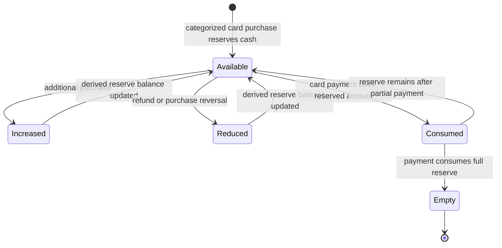
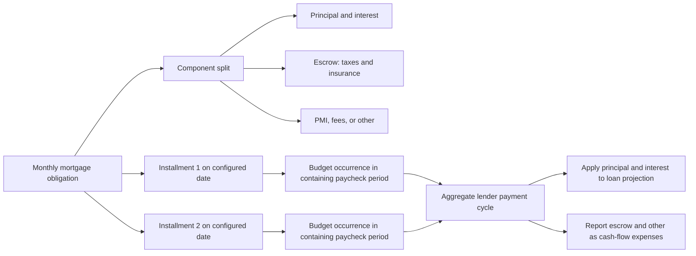
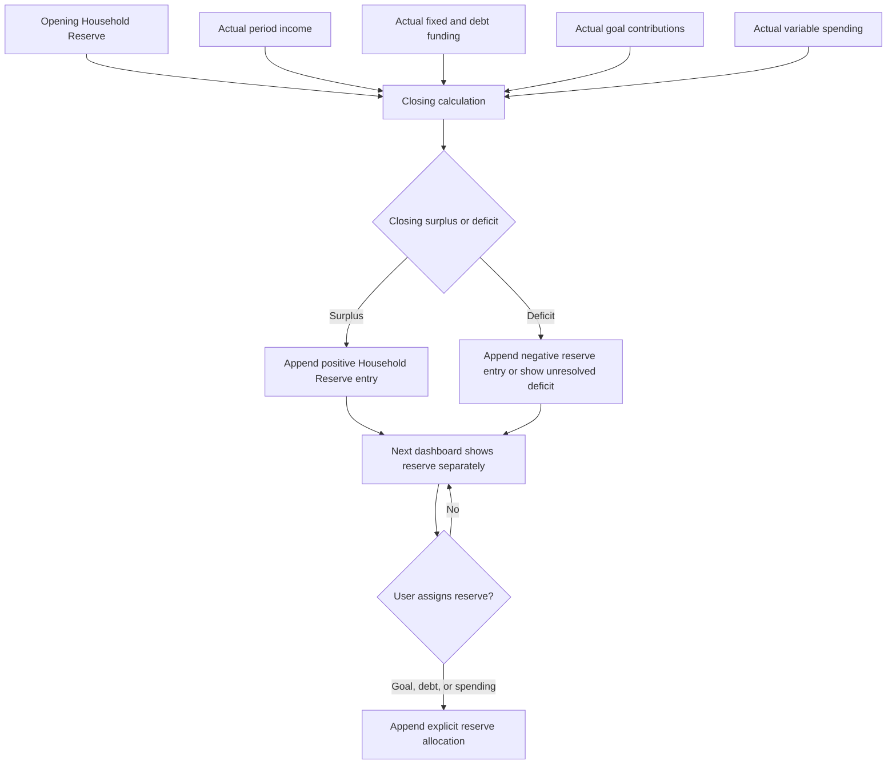
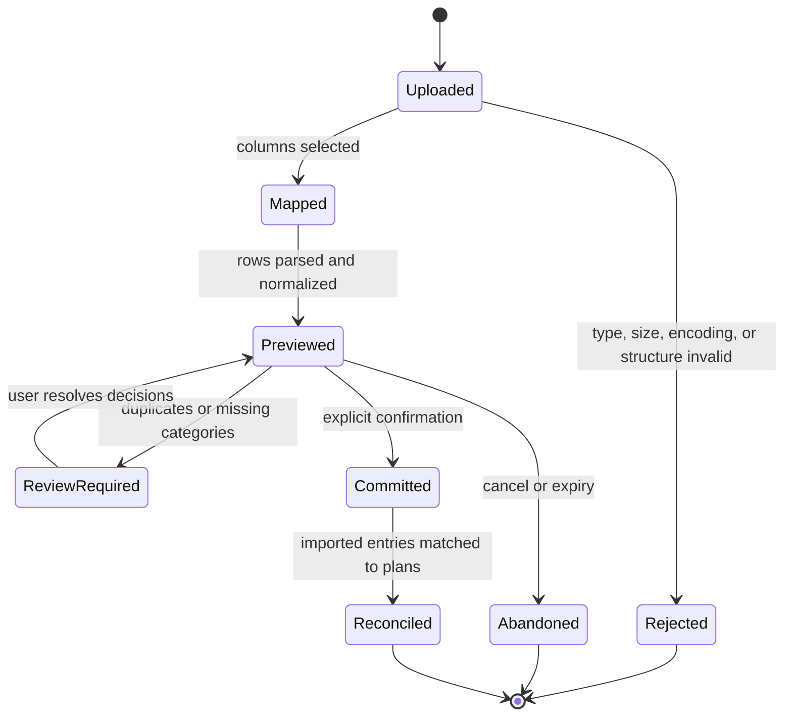
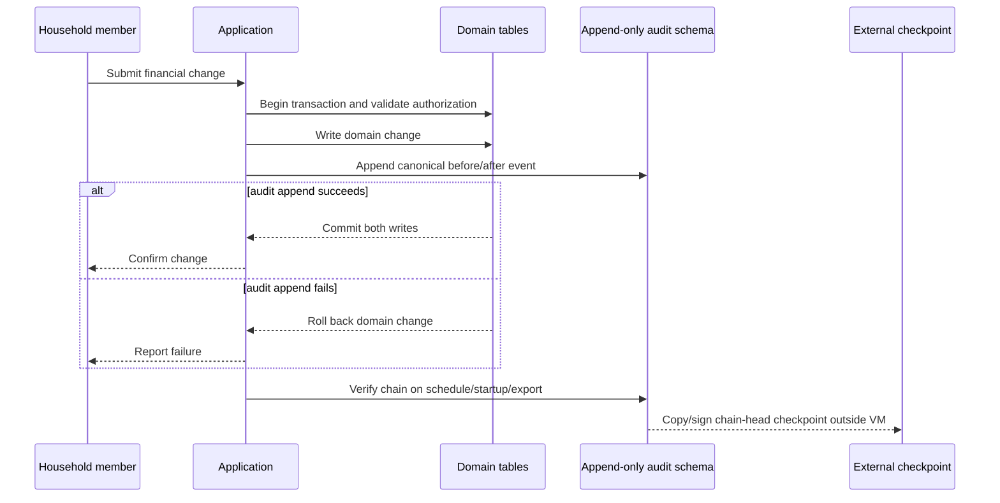
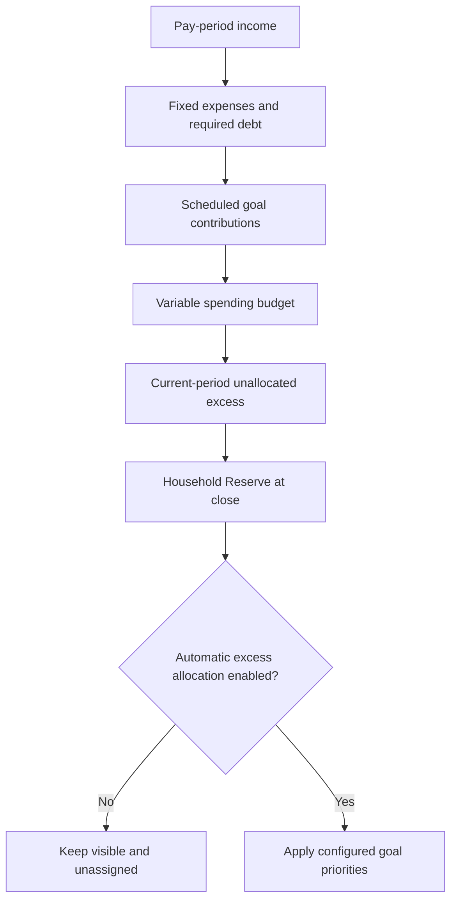

# Household Budget Application — Workflow and State Models

Status: Milestone 4 scheduling and paycheck-period workflows implemented
Last updated: 2026-08-22

## 1. Paycheck-period lifecycle

Rules:

- Opening a new period never requires the previous period to be irreversibly locked.
- Closing posts unallocated excess and unused spending to Household Reserve.
- Reopening a closed period preserves its original closing record and creates a new closing revision.
- The difference between closing revisions posts as a current reserve adjustment; later planned periods are not rewritten.

## 2. Source schedule and occurrence lifecycle

A source edit creates a new effective-dated revision. It regenerates only compatible, unmodified future occurrences. Moved, overridden, completed, and cancelled occurrences retain their local state and provenance.

## 3. Paycheck boundary generation

Default weekend/holiday policy is previous business day. If the actual arrival differs from the projection, the app asks whether the boundary should move.

## 4. Actual transaction classification

This separation prevents a categorized credit-card purchase and its later payment from both appearing as spending.

## 5. Credit-card reserve lifecycle

Reserve states are derived from append-only entries. If a card payment exceeds its reserve, the
excess is debt payoff funded by the current period or Household Reserve as explicitly selected.
Reversals also append corrections: a returned payment restores only the amount still backed by
active card purchases, while any portion already canceled by a refund remains budget-neutral.
Multiple partial refunds link to the original purchase and accumulate only to its original amount;
neither the purchase nor an earlier refund is edited.

## 6. Twice-monthly mortgage workflow

Rules:

- The two installments must total the configured full monthly obligation unless an intentional extra-principal amount is added.
- The schedule uses two selected monthly dates, not every 14 days.
- The lender's actual statement allocation supersedes estimates for history.
- Escrow does not reduce mortgage principal.

## 7. Period close and Household Reserve

Household Reserve never becomes paycheck income automatically.

## 8. CSV import lifecycle

No JournalEntry is created before `Committed`. Repeating a committed batch with the same idempotency key cannot duplicate transactions.
The file is parsed under byte/row/column/cell limits and is never retained as an upload. Confirmation
commits every accepted expense and its audit history atomically, then scrubs staged raw cells. A
failure rolls back the whole financial commit and leaves the reviewed staging data available.

## 9. Audit write and verification

## 10. Goal and reserve allocation

The automatic-excess setting remains off by default.
